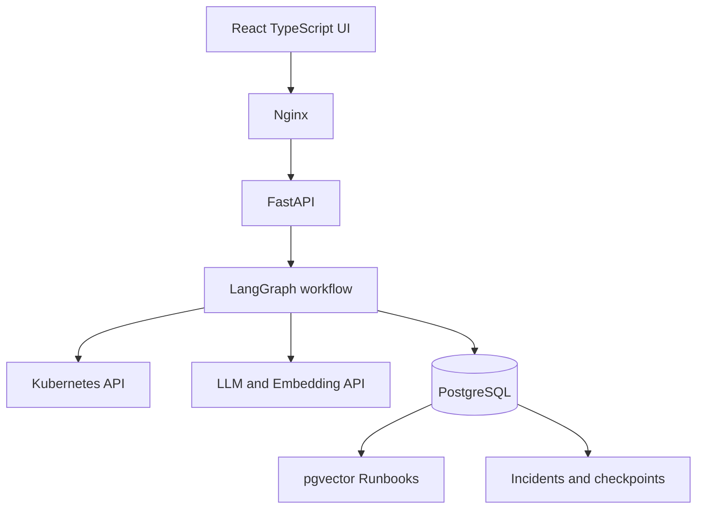
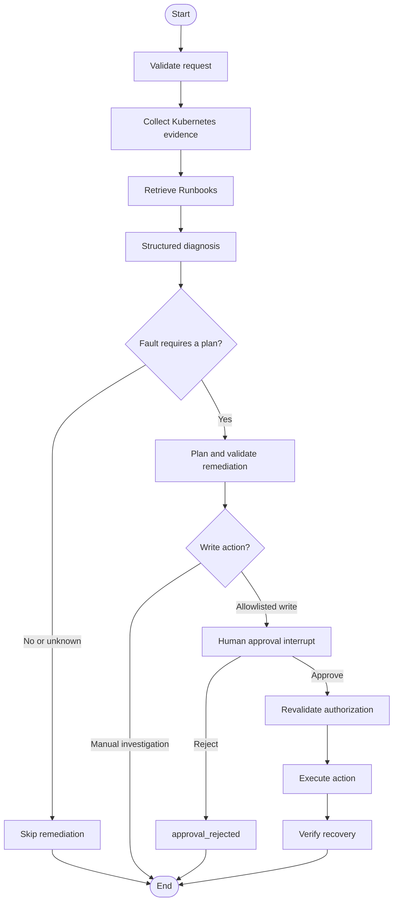

# Kubernetes Incident Agent

一个基于 LangGraph 的 Kubernetes 事故诊断与受控处置 Agent。系统从指定
Service 出发采集只读集群证据，结合 pgvector 中的 Runbook 和 LLM 生成结构化
诊断及处置方案；所有可执行写操作都必须通过人工审批、白名单校验和执行时重验，
最后对 Deployment、Pod 和 EndpointSlice 进行恢复验证。

项目提供 FastAPI、React 管理界面、PostgreSQL/PostgresSaver 持久化、故障注入
清单，以及适用于 Linux + kind 本地演示环境的 Docker Compose 启停流程。

## 核心能力

| 模块 | 能力 |
| --- | --- |
| Kubernetes Evidence | 从 Service 关联到 Pod、ReplicaSet、Deployment、EndpointSlice 和 Node，采集状态、事件与日志 |
| Runbook RAG | 加载 Markdown Runbook，生成稳定文档 ID，并通过 PostgreSQL/pgvector 检索相关片段 |
| 结构化诊断 | 使用受 Pydantic 模型约束的 LLM 输出故障类别、根因、置信度和引用 ID |
| 引用校验 | 拒绝不存在、重复或未被当前 Evidence/Runbook 支持的引用 |
| 处置规划 | 生成封闭参数结构，不接受任意 Shell 命令或自由格式 Kubernetes Patch |
| Human-in-the-loop | 使用 LangGraph `interrupt()` 暂停流程，通过批准或拒绝恢复同一 thread |
| 受控执行 | 仅允许白名单动作；审批记录、计划、事故和执行 ID 相互绑定 |
| 恢复验证 | 写入后检查探针/selector、Deployment generation、replicas、Ready Pod 和 EndpointSlice |
| 持久化恢复 | Incident Repository 保存元数据，PostgresSaver 保存完整 Graph State，支持进程重启恢复 |
| Web/API | FastAPI 提供事故创建、状态查询和审批接口；React 展示诊断、证据、Runbook、审批与执行结果 |

## 系统架构



生产前端由 Nginx 在 `8080` 端口提供，并把 `/api`、`/healthz` 和 `/readyz`
转发到 `8000` 端口的 FastAPI。后端使用同步 LangGraph 调用链，在 FastAPI
lifespan 内持有 PostgreSQL checkpointer 连接。

## 工作流



主要成功/终止状态：

| Phase | 含义 |
| --- | --- |
| `remediation_skipped` | 未检测到故障或诊断不需要自动处置 |
| `remediation_planned` | 已生成仅供人工处理的方案，或当前方案无需执行 |
| `awaiting_approval` | Graph 已中断，等待人工决定 |
| `approval_rejected` | 人工拒绝，执行器和恢复验证器不会运行 |
| `verification_succeeded` | 写操作成功或已应用，且恢复验证通过 |
| `remediation_execution_conflict` | 执行前发现资源并发变化 |
| `remediation_execution_failed` | Kubernetes 写操作失败 |
| `verification_failed` | 写入完成，但恢复验证失败或超时 |

## 支持范围

当前演示环境限定在 `agent-demo` namespace，入口资源为 Kubernetes Service。

| 故障类别 | 诊断 | 自动写操作 |
| --- | --- | --- |
| `crash_loop_backoff` | 支持 | 不执行，仅生成 `manual_investigation` |
| `image_pull_backoff` | 支持 | 不执行，仅生成 `manual_investigation` |
| `oom_killed` | 支持 | 不执行，仅生成 `manual_investigation` |
| `readiness_probe_error` | 支持 | `patch_readiness_probe` |
| `service_selector_mismatch` | 支持 | `patch_service_selector` |
| `no_fault_detected` / `unknown` | 支持 | 跳过处置 |

`infra/faults/` 提供对应的可重复故障清单。可执行写操作仅有：

- `patch_readiness_probe`
- `patch_service_selector`

## 安全边界

LLM 的输出不会直接成为 Kubernetes 命令。写操作必须依次通过以下边界：

1. 请求、诊断、处置方案和审批决定都使用严格的 Pydantic 模型。
2. 诊断只能引用本次工作流中实际存在的 Evidence ID 和 Runbook ID。
3. 处置方案只能使用预定义 action 和封闭参数字段，文本中禁止嵌入
   `kubectl`、`helm`、Shell、`curl`、`wget` 或 Docker 命令。
4. 写操作限定在 `agent-demo`，目标和值必须能由当前事故请求和 Kubernetes
   Evidence 证明。
5. 所有可执行方案必须进入 `interrupt()`，没有有效审批记录不能到达执行器。
6. 审批 ID、事故 ID、处置计划和执行 ID 相互绑定；重复或冲突决定返回 `409`。
7. 执行前重新读取资源，比较当前值，并使用 `metadata.resourceVersion` 防止覆盖
   并发修改。
8. 已成功执行的 action 不会重复执行；失败结果不能借用旧审批绕过检查。
9. PostgresSaver 强制启用严格 Msgpack 反序列化。
10. 执行结果保存修改前后快照、applied patch 和 rollback patch，并进行恢复验证。

项目会生成回滚补丁，但当前版本**不会自动执行回滚**。如果恢复验证失败，需要操作者
检查结果并发起新的受控流程。

`infra/rbac/` 定义了 `incident-agent` ServiceAccount 的最小读取和指定资源 Patch
权限。本地 Compose 挂载的是当前 kubeconfig，因此实际权限取决于该 kubeconfig
使用的身份；需要验证最小权限时，应使用受限 kubeconfig 或把 Agent 部署到集群内并
使用该 ServiceAccount。

## 技术栈

- Python 3.12、FastAPI、Pydantic
- LangGraph、LangChain、LangChain PostgreSQL
- PostgreSQL 16、pgvector、Psycopg 3
- Kubernetes Python Client、kind、kubectl
- React 19、TypeScript 6、Vite 8、Vitest、Oxlint
- Docker、Docker Compose、Nginx
- OpenAI-compatible LLM/Embedding API

## 目录结构

```text
.
├── backend/
│   ├── app/
│   │   ├── agent/          # Graph、节点、审批、策略、执行和恢复验证
│   │   ├── api/            # FastAPI 路由、Schema、依赖和错误映射
│   │   ├── llm/            # 诊断/处置模型客户端、Prompt 和上下文构造
│   │   ├── persistence/    # PostgreSQL、Incident Repository、迁移、PostgresSaver
│   │   ├── rag/            # Runbook 加载、Embedding、pgvector 和检索
│   │   └── tools/          # Kubernetes 只读工具和受控 Patch 工具
│   ├── tests/              # Fake 驱动的分层 pytest 测试
│   └── Dockerfile
├── frontend/
│   ├── src/api/            # 类型化 API Client 和统一错误
│   ├── src/features/       # 创建、轮询、诊断、审批、执行和恢复结果 UI
│   ├── nginx/              # 生产静态托管和 API 反向代理
│   └── Dockerfile
├── infra/
│   ├── demo-app/           # 健康基线
│   ├── faults/             # 五类故障注入清单
│   ├── kind/               # 两节点 kind 集群配置
│   ├── postgres/           # 独立 pgvector Compose
│   └── rbac/               # Reader/Remediator RBAC
├── knowledge/runbooks/     # Markdown Runbook 知识库
├── scripts/                # 索引、诊断、RBAC 和 Compose 脚本
├── compose.yaml
├── pyproject.toml
└── .env.example
```

## 前置条件

完整 Compose 流程针对 Linux 开发主机，要求：

- Docker Engine 和 Docker Compose v2
- kubectl
- kind
- 可访问的 OpenAI-compatible Chat/Embedding API
- 可读的 kubeconfig，默认 context 为 `kind-incident-agent`

直接在宿主机开发时还需要 Python `>=3.12,<3.13`、Node.js 24 和 npm。

## 快速开始

### 1. 创建演示集群

已有 `kind-incident-agent` context 时可跳过创建：

```bash
kind create cluster --config infra/kind/cluster.yaml
kubectl config use-context kind-incident-agent
```

部署健康基线和 RBAC：

```bash
kubectl apply -f infra/demo-app/baseline.yaml
kubectl apply -f infra/rbac/reader.yaml
kubectl apply -f infra/rbac/remediator.yaml
```

确认基线：

```bash
kubectl get deployment,pods,service,endpointslices -n agent-demo
```

### 2. 配置环境

```bash
cp .env.example .env
```

至少需要设置：

- `POSTGRES_PASSWORD`
- `PGVECTOR_URL` 中对应的 URL 编码密码
- `DASHSCOPE_API_KEY`
- `DASHSCOPE_BASE_URL`
- 实际使用的 LLM 和 Embedding 模型

不要提交 `.env`。仓库只保留不含真实凭据的 `.env.example`。

### 3. 一键启动

```bash
chmod +x scripts/compose_up.sh scripts/compose_stop.sh
./scripts/compose_up.sh
```

脚本会：

- 自动读取当前 UID/GID、kubeconfig 和 Kubernetes context；
- 创建或复用外部 PostgreSQL volume；
- 构建前后端镜像；
- 等待 PostgreSQL、FastAPI 和 Nginx 健康；
- 仅在向量表为空时调用 Embedding API 建立 Runbook 索引。

服务地址：

| 服务 | 地址 |
| --- | --- |
| Web UI | <http://127.0.0.1:8080> |
| 后端健康检查 | <http://127.0.0.1:8000/healthz> |
| 后端就绪检查 | <http://127.0.0.1:8000/readyz> |
| OpenAPI | <http://127.0.0.1:8000/docs> |

远程服务器开发时，可通过 VS Code SSH 端口转发访问 `8080`。

### 4. 安全停止

```bash
./scripts/compose_stop.sh
```

该脚本只停止容器，不删除 PostgreSQL volume。不要使用
`docker compose down -v`。

## Web 操作流程

1. 输入 namespace、Service 名称和事故描述。
2. 等待 Evidence 采集、Runbook 检索和 LLM 诊断完成。
3. 检查诊断引用、结构化 Evidence、Runbook 和处置参数。
4. 如果进入 `awaiting_approval`，填写审批人和审计备注。
5. 拒绝方案，或明确确认后批准执行。
6. 查看审批记录、执行前后快照、Patch、恢复验证和错误信息。

前端会轮询事故状态，并在 URL/localStorage 中保存最近事故 ID，以便刷新页面或
服务重启后继续查看。

## API

| Method | Path | 说明 |
| --- | --- | --- |
| `GET` | `/healthz` | 进程健康；不检查外部依赖 |
| `GET` | `/readyz` | FastAPI lifespan 是否完成初始化 |
| `POST` | `/api/v1/incidents` | 创建事故并运行 Graph，直到终态或审批中断 |
| `GET` | `/api/v1/incidents/{incident_id}` | 读取 checkpoint 中的最新状态，不重新运行 Graph |
| `POST` | `/api/v1/incidents/{incident_id}/approval` | 提交审批决定并恢复中断的 Graph |

创建事故：

```bash
curl -sS -X POST http://127.0.0.1:8080/api/v1/incidents \
  -H 'Content-Type: application/json' \
  -d '{
    "namespace": "agent-demo",
    "service_name": "order-service",
    "description": "order-service readiness probe 异常，请基于证据诊断。"
  }'
```

创建接口会同步运行工作流，真实 LLM 调用期间可能需要等待。HTTP `202` 表示事故已
保存且工作流已运行到当前终态或人工审批中断，不代表修复已经执行。

查询事故：

```bash
curl -sS \
  http://127.0.0.1:8080/api/v1/incidents/INCIDENT_ID
```

审批请求必须使用创建/查询响应中的 `approval_request.approval_id`：

```bash
curl -sS -X POST \
  http://127.0.0.1:8080/api/v1/incidents/INCIDENT_ID/approval \
  -H 'Content-Type: application/json' \
  -d '{
    "approval_id": "apr-0123456789abcdef",
    "approved": true,
    "approver": "operator@example.com",
    "comment": "Reviewed evidence, target and rollback plan."
  }'
```

重复决定、过期审批或不处于等待状态的事故返回 `409`。请求校验、服务错误和 Graph
依赖错误均使用统一的结构化错误响应。

## 故障演示

以 readiness probe 错误为例：

```bash
kubectl apply -f infra/faults/04-readiness-error.yaml

kubectl get deployment order-service \
  -n agent-demo \
  -o jsonpath='{.spec.template.spec.containers[0].readinessProbe.httpGet.path}{"\n"}'
```

预期路径为 `/wrong-health`。在 Web UI 创建事故并批准合法方案后，最终 phase 应为
`verification_succeeded`，探针恢复为 `/healthz`。

拒绝方案时，phase 应为 `approval_rejected`，且 `action_result` 和
`verification_result` 都为空，Kubernetes 资源不会被执行器修改。

演示结束后恢复基线：

```bash
kubectl apply -f infra/demo-app/baseline.yaml
kubectl rollout status deployment/order-service \
  -n agent-demo \
  --timeout=180s
```

不要使用 `scripts/reset_demo.sh` 进行日常恢复；该脚本会重建演示 namespace。

## 测试

后端：

```bash
python -m venv .venv
source .venv/bin/activate
python -m pip install -e .
pytest -q
```

前端：

```bash
cd frontend
npm ci
npm run lint
npm run test
npm run build
```

Compose 和 Shell：

```bash
bash -n scripts/compose_up.sh
bash -n scripts/compose_stop.sh
docker compose -f compose.yaml config --quiet
```

pytest 和 Vitest 默认使用 Fake，不应意外连接真实 Kubernetes、PostgreSQL、LLM 或
Embedding。真实依赖仅用于显式的集成验收。

## 持久化

- `incident_agent_app.incidents` 保存事故 ID、thread ID、请求和当前 phase。
- LangGraph `checkpoints`、`checkpoint_blobs`、`checkpoint_writes` 保存完整 Graph State。
- `langchain_pg_collection` 和 `langchain_pg_embedding` 保存 Runbook 向量。
- `incident_id` 同时作为 LangGraph `thread_id`，GET 接口据此恢复状态。
- FastAPI lifespan 持有 PostgresSaver，启动时执行幂等迁移和 checkpointer setup。

因此，后端进程或完整 Compose 重启后，待审批、已批准、已拒绝以及执行/验证结果仍可
通过原事故 ID 查询。

## 当前限制

- 演示写入范围固定为 `agent-demo`，RBAC 清单针对 `order-service`。
- Graph/API 使用同步调用链，创建和审批请求会等待外部调用完成。
- `/readyz` 表示应用初始化完成，不持续探测 Kubernetes、PostgreSQL 或 LLM。
- 当前没有用户认证、审批角色授权、限流、多租户和多集群管理。
- 回滚补丁会被记录，但不会自动执行。
- 根 Compose 使用 Linux host networking 访问 kind API，不面向 Docker Desktop/WSL2。

这些约束是当前 `0.1.0` MVP 的明确边界，不应将此项目直接用于生产集群。
